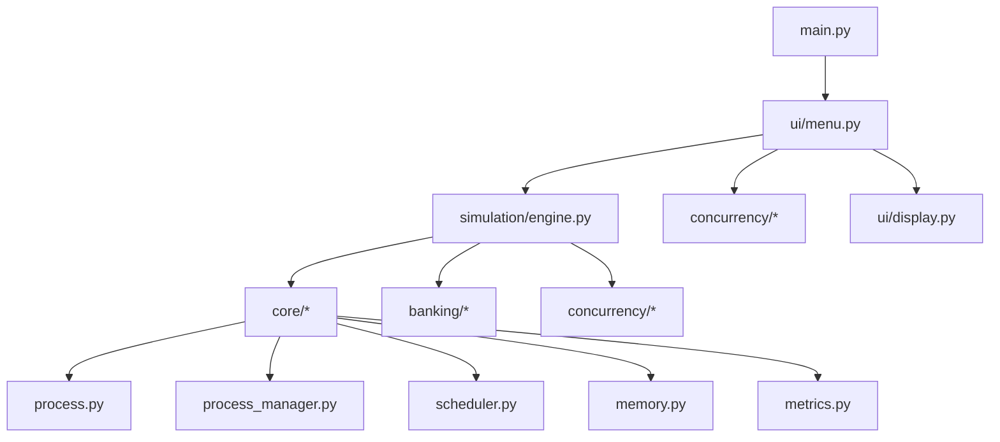

# Explicação do Código — Banco Nexus

Este documento descreve a **estrutura do projeto**, o **papel de cada arquivo** e **como as partes se conectam**. Para uso operacional, veja o [Guia de Uso](GUIA_DE_USO.md). Para perguntas da banca, veja [perguntasTecnicas.md](perguntasTecnicas.md).

---

## Visão geral

O projeto é um **simulador de Sistema Operacional** com temática bancária. Cada **processo** representa uma operação (transferência, saque, etc.). O sistema roda no **terminal** e demonstra escalonamento, threads, mutex, semáforos, memória e deadlock.



### Princípio de organização

| Camada | Pasta | Responsabilidade |
|---|---|---|
| Entrada | `main.py` | Inicia o programa |
| Interface | `src/ui/` | Menus e exibição — **não** contém lógica de SO |
| Simulação | `src/simulation/` | Orquestra ticks, memória, locks de conta |
| Núcleo SO | `src/core/` | PCB, processos, escalonadores, métricas, memória |
| Domínio bancário | `src/banking/` | Contas, transações, tipos de operação |
| Concorrência | `src/concurrency/` | Mutex, semáforos, produtor-consumidor, deadlock |
| Testes | `tests/` | Validação unitária dos algoritmos |

---

## Raiz do projeto

| Arquivo | Função |
|---|---|
| [`main.py`](../main.py) | Ponto de entrada. Ajusta o `sys.path` e chama `MainMenu().run()`. |
| [`requirements.txt`](../requirements.txt) | Dependências: `colorama` (cores no terminal) e `pytest` (testes). |
| [`README.md`](../README.md) | Visão geral, como executar e links para a documentação. |

---

## `src/core/` — Núcleo do Sistema Operacional

Implementação própria dos conceitos centrais de SO. Não depende de bibliotecas de escalonamento externas.

### `process.py`

Define o **PCB** (Process Control Block) — a “ficha” de cada processo/operação.

- **`ProcessState`** — estados: `NEW`, `READY`, `RUNNING`, `BLOCKED`, `TERMINATED`
- **`Priority`** — prioridades: `VIP` (Private), `NORMAL` (Corrente), `BATCH` (Backoffice)
- **`PCB`** — campos obrigatórios do enunciado:
  - `pid`, `priority`, `burst_time`, `remaining_time`, `state`, `quantum`, `deadline`
  - Extras bancários: `operation_type`, `account_id`, `pages_required`, `block_reason`
  - Métricas: `waiting_time`, `start_time`, `finish_time`, `response_time`, `turnaround_time`

O método `needs_account_lock()` indica se a operação precisa travar uma conta (transferência, saque, etc.).

### `process_manager.py`

**Gerenciador de processos** — cria, admite, bloqueia, desbloqueia e finaliza processos.

| Método | Ação |
|---|---|
| `create_process()` | Cria PCB com estado `NEW` |
| `admit_process()` | Move para `READY` e coloca na fila |
| `block_process()` | Move para `BLOCKED`, remove da fila ready |
| `unblock_process()` | Volta para `READY` |
| `terminate_process()` | Move para `TERMINATED` |
| `set_priority()` | Altera prioridade |
| `admit_arrived()` | Admite processos cujo `arrival_time` já passou |
| `generate_random_processes()` | Gera processos genéricos (uso interno) |

Mantém três estruturas: `ready_queue`, `blocked_queue`, `terminated`.

### `scheduler.py`

**Escalonadores** — decidem qual processo executa a cada tick.

```
Scheduler (abstrato)
├── tick()           → loop de um ciclo: espera, seleção, execução, preempção
├── select_next()    → implementado por cada algoritmo
└── on_preempt()     → o que fazer quando o quantum acaba

RoundRobinScheduler  → fila circular (deque), quantum fixo
PriorityScheduler  → menor valor de prioridade primeiro + aging
EDFScheduler         → menor deadline primeiro + preempção por prazo
```

O método `tick()` em cada ciclo:

1. Incrementa tempo de espera dos processos na fila ready
2. Seleciona o próximo processo (`select_next`)
3. Passa pelo `resource_gate` (conta bloqueada → suspende)
4. Decrementa `remaining_time` (burst)
5. Finaliza se burst = 0, ou preempta se quantum = 0 (RR)

### `metrics.py`

Coleta **métricas da simulação**:

- Processos concluídos
- Snapshots da fila ao longo do tempo
- Médias de espera, resposta e turnaround
- Contagem de deadlines perdidos
- Resumo de uso de memória

Usado pelo Painel Gerencial ao final da Central de Processamento.

### `memory.py`

**Gerenciador de memória** (`BankMemoryManager`):

- Memória dividida em **quadros** (frames) fixos
- `allocate(pid, pages)` — ocupa quadros livres para uma operação
- `free(pid)` — libera quadros ao terminar
- Se não há quadros → `page_faults++` e retorna `False` (operação bloqueada)
- Protegido por `BankMutex`

Não implementa substituição de páginas (FIFO/LRU) — apenas alocação e bloqueio.

---

## `src/banking/` — Domínio bancário

Traduz a temática do banco em dados que o núcleo de SO consome.

### `accounts.py`

- **`Account`** — conta com `holder`, `balance` e `Lock` próprio
- **`AccountRegistry`** — cadastro de contas; `setup_default_accounts()` cria Alice, Bob e Carlos

### `transactions.py`

- **`TransactionType`** — enum: Transferência, Saque, Depósito, etc.
- **`Transaction`** — modelo de transação com `tx_id`, contas, valor e timestamp

### `operations.py`

- **`BankingOperationFactory`** — gera processos (PCBs) a partir de tipos de operação bancária
- Define `BURST_BY_OPERATION` — operações mais pesadas têm burst maior
- Define `PRIORITY_BY_OPERATION` — saques VIP, antifraude Backoffice, etc.
- `generate_banking_workload()` — cria N operações para a simulação da Central de Processamento

### `account_locks.py`

- **`AccountLockManager`** — controla qual processo está usando cada conta
- `try_acquire()` / `release()` / `release_all_for_process()`
- Usado pela `SimulationEngine` para bloquear operações quando a conta está em uso

---

## `src/concurrency/` — Concorrência e sincronização

### `sync_primitives.py`

Encapsula primitivas do Python e implementa demos de condição de corrida.

| Classe / função | Papel |
|---|---|
| `BankMutex` | Wrapper de `threading.Lock` |
| `BankSemaphore` | Wrapper de `threading.Semaphore` |
| `SharedBalance` | Saldo compartilhado — `deposit_unsafe()` vs `deposit_safe()` |
| `TransactionLog` | Log em arquivo — `append_unsafe()` vs `append_safe()` |
| `run_race_condition_demo()` | Demo de corrida no saldo |
| `run_log_race_demo()` | Demo de corrida no log |

### `producer_consumer.py`

- **`ProducerConsumerBuffer`** — buffer limitado com padrão clássico:
  - `empty_slots` (semáforo) — vagas no buffer
  - `filled_slots` (semáforo) — itens para consumir
  - `buffer_lock` (mutex) — acesso à lista
- **`run_producer_consumer_demo()`** — 2 ATMs + 1 backend em threads

### `deadlock.py`

- **`DeadlockDemo`** — cenário de transferências cruzadas
- `_transfer_unsafe()` — locks sem ordenação → deadlock (timeout 3s)
- `_transfer_safe()` — ordenação por menor ID de conta → prevenção
- `run_deadlock_scenario()` — executa as duas threads e retorna resultado

---

## `src/simulation/` — Orquestração

### `engine.py`

**Coração da simulação** — une núcleo SO, banco e concorrência.

#### `SimulationConfig`

Parâmetros: quantum, número de processos, delay, modo rápido, threads ATM, tipo de escalonador, quadros de memória.

#### `SimulationEngine`

| Método | Função |
|---|---|
| `setup()` | Cria processos, escolhe escalonador (RR/PRIORITY/EDF) |
| `run()` | Loop principal de ticks até todos terminarem |
| `_admit_and_allocate()` | Admite processos e tenta alocar memória |
| `_resource_gate()` | Bloqueia se conta bancária estiver em uso |
| `_try_allocate_memory()` | Aloca quadros ou bloqueia por memória |
| `_release_process_resources()` | Libera memória e contas ao terminar |
| `_try_unblock_waiters()` | Desbloqueia processos quando recurso libera |
| `run_concurrent_atm_demo()` | Demo com threads ATM + backend + monitor |
| `run_memory_pressure_demo()` | Demo isolada de pressão de memória |
| `start_monitor_thread()` | Thread de auditoria em background |

#### Fluxo de um tick (`run()`)

```
1. admit_arrived + alocar memória
2. tentar desbloquear processos suspensos
3. scheduler.tick()  → executa 1 unidade de CPU
4. liberar recursos de processos terminados
5. atualizar métricas e chamar callback da UI (on_tick)
6. current_tick++
```

---

## `src/ui/` — Interface terminal

Separa **apresentação** da **lógica de SO**. O menu só chama funções e exibe resultados.

### `menu.py`

- **`MainMenu`** — loop do menu principal (opções 0–8)
- Cada opção chama um submétodo (`_transaction_center_menu`, `_integrity_audit_menu`, etc.)
- Configura `SimulationConfig` e instancia `SimulationEngine` quando necessário
- Não implementa escalonamento nem sincronização

### `display.py`

- **`Display`** — funções estáticas de saída formatada
- `bank_banner()`, `accounts_panel()`, `operation_table()`, `queue_display()`
- `memory_map()`, `metrics_report()`, `log_lines()`, `key_value()`
- Usa `colorama` para cores nos estados

### `banking_labels.py`

- Textos e rótulos bancários (BANCO NEXUS, nomes de perfil, estados traduzidos)
- `format_account_id()`, `format_currency()`, `block_reason_label()`

---

## `tests/` — Testes unitários

| Arquivo | O que valida |
|---|---|
| `test_process_manager.py` | Criar, admitir, bloquear, desbloquear, prioridade |
| `test_scheduler.py` | RR completa processos; Prioridade escolhe VIP; EDF escolhe menor deadline |
| `test_deadlock.py` | Deadlock detectado sem prevenção; 2 transferências com prevenção |
| `test_memory.py` | Alocação, liberação, page fault, desbloqueio |
| `test_log_race.py` | Log íntegro com mutex; perda de linhas sem mutex |

Executar: `python -m pytest tests/ -v`

---

## Fluxo de execução completo

### Ao iniciar (`python main.py`)

```
main.py
  → MainMenu.__init__()
      → cria SimulationConfig, AccountRegistry (Alice, Bob, Carlos)
  → MainMenu.run()
      → bank_banner() + accounts_panel()
      → loop: input do usuário → rota para submétodo
```

### Central de Processamento (opção 1)

```
menu._transaction_center_menu()
  → SimulationEngine(config).setup()
      → ProcessManager novo
      → BankingOperationFactory.generate_banking_workload()  # 8 operações
      → RoundRobinScheduler | PriorityScheduler | EDFScheduler
  → engine.run(on_tick=callback)
      → para cada tick:
          admit + memória + desbloqueio
          scheduler.tick()
          métricas
          display na tela (a cada 2 ticks ou passo a passo)
  → display.metrics_report()
```

### Auditoria de integridade (opção 3)

```
menu._integrity_audit_menu()
  → run_race_condition_demo() ou run_log_race_demo()
      → 4 threading.Thread
      → SharedBalance ou TransactionLog
      → com ou sem BankMutex
```

### Transferências / deadlock (opção 4)

```
menu._transfer_management_menu()
  → DeadlockDemo(registry=contas).run_deadlock_scenario()
      → 2 threads, _transfer_unsafe ou _transfer_safe
```

---

## Dependências entre módulos

```
ui/menu.py
  ├── simulation/engine.py
  │     ├── core/process_manager.py → core/process.py
  │     ├── core/scheduler.py       → core/metrics.py
  │     ├── core/memory.py          → concurrency/sync_primitives.py
  │     ├── banking/operations.py   → banking/transactions.py
  │     └── banking/account_locks.py
  ├── concurrency/deadlock.py       → banking/accounts.py
  ├── concurrency/producer_consumer.py
  └── concurrency/sync_primitives.py

ui/display.py
  ├── banking/accounts.py
  └── ui/banking_labels.py
```

**Regra:** `core/` não importa `ui/`. A interface depende do núcleo, não o contrário.

---

## Mapa arquivo a arquivo

| Arquivo | Uma linha |
|---|---|
| `main.py` | Entrada do programa |
| `src/core/process.py` | PCB, estados, prioridades |
| `src/core/process_manager.py` | CRUD e filas de processos |
| `src/core/scheduler.py` | RR, Prioridade, EDF |
| `src/core/metrics.py` | Espera, resposta, turnaround |
| `src/core/memory.py` | Quadros de memória |
| `src/banking/accounts.py` | Contas e saldos |
| `src/banking/transactions.py` | Tipos de transação |
| `src/banking/operations.py` | Operações → processos |
| `src/banking/account_locks.py` | Lock de conta por processo |
| `src/concurrency/sync_primitives.py` | Mutex, semáforo, demos de corrida |
| `src/concurrency/producer_consumer.py` | Buffer produtor-consumidor |
| `src/concurrency/deadlock.py` | Deadlock e prevenção |
| `src/simulation/engine.py` | Loop de simulação e demos com threads |
| `src/ui/menu.py` | Menus interativos |
| `src/ui/display.py` | Tabelas, painel, cores |
| `src/ui/banking_labels.py` | Textos do Banco Nexus |

---

## Onde encontrar cada conceito de SO

| Conceito | Arquivo(s) principal(is) |
|---|---|
| Processo / PCB | `core/process.py` |
| Estados e filas | `core/process_manager.py` |
| Round Robin | `core/scheduler.py` → `RoundRobinScheduler` |
| Prioridade | `core/scheduler.py` → `PriorityScheduler` |
| EDF / deadline | `core/scheduler.py` → `EDFScheduler` |
| Mutex | `concurrency/sync_primitives.py` |
| Semáforo | `concurrency/sync_primitives.py`, `producer_consumer.py` |
| Produtor-consumidor | `concurrency/producer_consumer.py` |
| Deadlock | `concurrency/deadlock.py` |
| Memória | `core/memory.py` + `simulation/engine.py` |
| Threads reais | `engine.py`, `producer_consumer.py`, `sync_primitives.py` |
| Interface | `ui/menu.py`, `ui/display.py` |

---

## Documentação relacionada

- [GUIA_DE_USO.md](GUIA_DE_USO.md) — como executar cada fluxo no terminal
- [ROTEIRO_APRESENTACAO.md](ROTEIRO_APRESENTACAO.md) — script oral para a banca
- [perguntasTecnicas.md](perguntasTecnicas.md) — perguntas e respostas técnicas
- [README.md](../README.md) — visão geral e instalação
