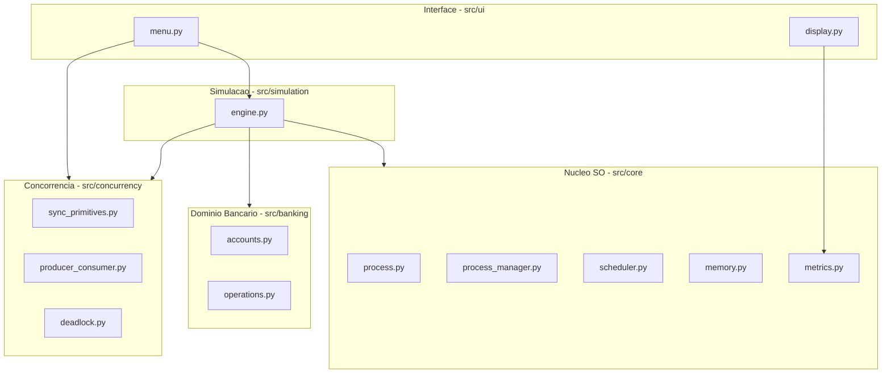
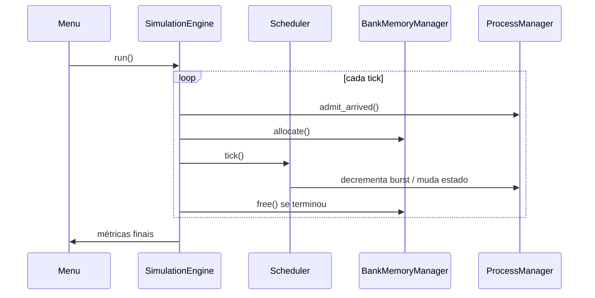

# Guia de Slides — Banco Nexus

Roteiro para montar a apresentação do projeto. Cada seção abaixo corresponde a **um ou mais slides**. Sugestão total: **12 a 15 slides** + demo ao vivo (~17 min).

**Documentação de apoio:** [Guia de Uso](GUIA_DE_USO.md) | [Roteiro](ROTEIRO_APRESENTACAO.md) | [Perguntas Técnicas](perguntasTecnicas.md) | [Explicação do Código](explicacaoCodigo.md)

---

## Slide 1 — Capa

**Título:** Banco Nexus — Simulador de Sistema Operacional em Tempo Real

**Subtítulo:** Avaliação de Sistemas Operacionais — Engenharia de Software

**Incluir:**
- Nome da equipe e integrantes
- Instituição / período
- Linguagem: Python
- Data da apresentação

**Nota do apresentador:** Abrir com uma frase de impacto: *"Um banco digital onde cada transação é um processo e cada caixa eletrônico é uma thread."*

---

## Slide 2 — Descrição do Sistema

**Título:** O que é o Banco Nexus?

### Conteúdo sugerido

- Simulador de **Sistema Operacional em tempo real** com temática **bancária**
- Desenvolvido em **Python**, interface via **terminal**
- Cada **processo** = uma operação bancária (transferência, saque, depósito, antifraude…)
- Cada **thread** = recurso concorrente (ATM, backend, monitor de auditoria)
- Objetivo: demonstrar na prática os conceitos de SO estudados no semestre

### Analogia visual (tabela no slide)

| Conceito SO | No Banco Nexus |
|---|---|
| Processo | Transação bancária |
| PCB | Protocolo da operação |
| Thread | Caixa eletrônico / processador |
| Fila de CPU | Fila de atendimento |
| Memória | Cache de dados da operação |
| Mutex | Trava de segurança do saldo |

### Demo rápida (opcional neste slide)

Mostrar a tela inicial: banner **BANCO NEXUS**, contas Alice/Bob/Carlos e menu principal.

---

## Slide 3 — Arquitetura do Projeto

**Título:** Arquitetura em camadas

### Diagrama para o slide



### Bullets

- **5 camadas** com responsabilidades separadas
- `ui/` — apenas menus e exibição (sem lógica de escalonamento)
- `core/` — PCB, escalonadores, memória, métricas (**implementação própria**)
- `banking/` — contas, transações, operações
- `concurrency/` — mutex, semáforos, produtor-consumidor, deadlock
- `simulation/` — orquestra o loop de ticks e integra tudo

### Estrutura de pastas (bloco de código enxuto)

```
src/
├── core/           PCB, escalonamento, memória, métricas
├── banking/        Contas e operações
├── concurrency/    Sincronização e deadlock
├── simulation/     Engine da simulação
└── ui/             Interface terminal
```

---

## Slide 4 — Funcionalidades Implementadas (visão geral)

**Título:** O que o sistema faz?

### Menu principal (tabela)

| # | Módulo | Conceito SO |
|---|---|---|
| 1 | Central de Processamento | Escalonamento |
| 2 | Rede de ATMs | Threads e concorrência |
| 3 | Auditoria de Integridade | Condição de corrida / mutex |
| 4 | Transferências Simultâneas | Deadlock e prevenção |
| 5 | Cache de Memória | Gerenciamento de memória |
| 6 | Esteira de Transações | Produtor-consumidor |
| 7 | Parâmetros do Sistema | Configuração |
| 8 | Painel Gerencial | Métricas de desempenho |

### Checklist do enunciado (item 3)

- Gerência de processos (criar, bloquear, finalizar, prioridades)
- Threads reais (`threading.Thread`)
- 3 algoritmos de escalonamento (RR, Prioridade, EDF)
- Mutex e semáforos
- Produtor-consumidor
- Deadlock + prevenção
- Interface terminal navegável

---

## Slide 5 — Funcionalidades: Gerência de Processos

**Título:** Gerência de Processos (PCB)

### Campos do PCB

| Campo | Significado bancário |
|---|---|
| PID (Protocolo) | Identificador da operação |
| Prioridade (Perfil) | Private / Corrente / Backoffice |
| Burst time | Tempo de processamento |
| Estado | Na fila, Processando, Suspensa, Concluída |
| Quantum | Fatia de CPU (Round Robin) |
| Deadline (Prazo) | Prazo máximo de conclusão |

### Estados do processo

```
NEW → READY → RUNNING → BLOCKED → TERMINATED
                  ↑___________|
```

### Motivos de bloqueio no projeto

- Conta bancária em uso por outra operação
- Falta de quadros de memória (cache)

**Demo sugerida:** Central de Processamento, modo passo a passo (`1 → 2 → 2`).

---

## Slide 6 — Algoritmos Utilizados (Escalonamento)

**Título:** Algoritmos de escalonamento

### Tabela comparativa

| Algoritmo | Ideia | Uso no banco | Complexidade |
|---|---|---|---|
| **Round Robin** | Fila circular + quantum | Fila justa — todos com tempo igual | O(1) por seleção |
| **Prioridade** | Menor número = maior prioridade + aging | Clientes Private primeiro | O(n log n) |
| **EDF** | Menor deadline primeiro | Operações urgentes por prazo | O(n log n) |

### Por que três algoritmos?

- **RR** — equidade entre operações
- **Prioridade** — importância do cliente (VIP)
- **EDF** — urgência temporal (deadline)

### Bullets técnicos

- Implementação **própria** em `src/core/scheduler.py`
- Fila circular com `collections.deque` (RR)
- Preempção por quantum (RR) e por deadline (EDF)
- Aging evita starvation de processos Backoffice

**Demo sugerida:** Comparar RR (`1→1`) e Prioridade (`1→2`) na Central de Processamento.

---

## Slide 7 — Algoritmos Utilizados (Concorrência e Sincronização)

**Título:** Sincronização, exclusão mútua e deadlock

### Mutex (`BankMutex`)

- Protege: saldo, log, buffer, memória
- Demonstração: saldo incorreto **sem** mutex vs correto **com** mutex

### Semáforos (`BankSemaphore`)

- `empty_slots` / `filled_slots` no buffer produtor-consumidor
- Limite de ATMs simultâneos na rede

### Produtor-consumidor

- 2 ATMs produzem → buffer limitado → 1 backend consome

### Deadlock

| Modo | Estratégia | Resultado |
|---|---|---|
| Sem prevenção | Locks em ordem oposta | Travamento (timeout 3s) |
| Com prevenção | Ordenação de contas (menor ID primeiro) | 2 transferências OK |

**Demo sugerida:** Auditoria `3→1` e `3→2`; Depois Transferências `4→1` e `4→2`.

---

## Slide 8 — Explicação Técnica

**Título:** Como funciona por dentro?

### Fluxo de um ciclo (tick)

```
1. Admitir processos que chegaram
2. Tentar alocar memória (ou bloquear)
3. Desbloquear processos com recurso disponível
4. Escalonador seleciona processo e executa 1 unidade de CPU
5. Liberar memória/conta de processos terminados
6. Atualizar métricas e exibir na tela
```

### Diagrama de sequência simplificado



### Bibliotecas e justificativa

| Biblioteca | Papel |
|---|---|
| `threading` | Primitivas Lock/Semaphore/Thread |
| `colorama` | Cores no terminal |
| `pytest` | 15 testes automatizados |
| Stdlib (`deque`, `enum`, `dataclasses`) | Estruturas de dados |

> **Destaque:** Algoritmos de SO são implementação própria; `threading` é só primitiva da linguagem.

### O que NÃO foi implementado (seja honesto)

- Substituição de páginas (FIFO/LRU) — há alocação e bloqueio, sem despejo de páginas

---

## Slide 9 — Análise de Desempenho

**Título:** Métricas e análise de desempenho

### Métricas coletadas (`SimulationMetrics`)

| Métrica | Significado |
|---|---|
| Tempo de espera | Ciclos na fila antes de executar |
| Tempo de resposta | Chegada → primeiro ciclo de CPU |
| Turnaround | Chegada → conclusão |
| Prazos perdidos | Operações que terminaram após o deadline |
| Page faults | Falhas de alocação de memória |
| Transações concluídas | Total processado |

### Onde ver

- **Painel Gerencial** (menu `8`) após rodar a Central de Processamento
- Tabela ao vivo durante a simulação (colunas Fila, Resp., Prazo)

### Comparação esperada entre algoritmos (para discutir)

| Algoritmo | Espera média | Resposta VIP | Fairness |
|---|---|---|---|
| Round Robin | Moderada, equilibrada | Não privilegia VIP | Alta |
| Prioridade | Menor para VIP | Melhor para Private | Baixa sem aging |
| EDF | Depende do prazo | Melhor para urgentes | Foco em deadline |

### Sugestão de slide com dados reais

Rodar **3 simulações** (RR, Prioridade, EDF) com os mesmos 8 processos e colar no slide uma tabela como:

| Política | Ticks | Espera média | Resposta média | Prazos perdidos |
|---|---|---|---|---|
| Round Robin | ? | ? | ? | ? |
| Prioridade | ? | ? | ? | ? |
| EDF | ? | ? | ? | ? |

*(Preencher com valores obtidos na execução — torna a apresentação mais convincente.)*

### Validação automatizada

```
python -m pytest tests/ -v
→ 15 testes passando
```

---

## Slide 10 — Dificuldades Encontradas

**Título:** Desafios e como resolvemos

### Sugestões de conteúdo (adapte à experiência real da equipe)

| Dificuldade | Como foi tratada |
|---|---|
| Integrar escalonamento com bloqueio por conta e memória | `resource_gate` no scheduler + `_try_unblock_waiters()` na engine |
| Deadlock travar o terminal | `acquire(timeout=3)` para detectar em vez de bloquear para sempre |
| Condição de corrida difícil de reproduzir | Demo dedicada com 4 threads × 100 iterações |
| Interface técnica demais para temática bancária | Refatoração para Banco Nexus com rótulos de negócio |
| Sincronizar produtor-consumidor sem perder itens | Semáforos + mutex na ordem correta (acquire → crítico → release) |
| Prioridade causando starvation | Aging a cada 5 ticks eleva prioridade de processos esperando |
| Simulação lenta no terminal | Modo expediente (`fast_mode`) e delay configurável |

### Bullets para falar

- Separar **UI** de **lógica de SO** exigiu planejamento da arquitetura desde o início
- Testar concorrência exige atenção a **timeouts** e cenários reproduzíveis
- Documentar bem o projeto facilita a apresentação e a manutenção

---

## Slide 11 — Demonstração ao Vivo

**Título:** Demo — Roteiro sugerido (~5 min dentro da apresentação)

| Ordem | Ação | Input | Tempo |
|---|---|---|---|
| 1 | Banner + contas | (início) | 30s |
| 2 | Prioridade passo a passo | `1 → 2 → 2` | 2 min |
| 3 | Saldo sem/com mutex | `3 → 1`, `3 → 2` | 1 min |
| 4 | Deadlock + prevenção | `4 → 1`, `4 → 2` | 1 min |
| 5 | Painel Gerencial | `8` | 30s |

*Detalhes completos em [ROTEIRO_APRESENTACAO.md](ROTEIRO_APRESENTACAO.md).*

---

## Slide 12 — Conclusão

**Título:** Conclusão

### O que foi alcançado

- Simulador funcional de SO em tempo real com temática bancária
- Todos os requisitos do **item 3** (processos, threads, escalonamento, mutex, semáforos, sincronização, deadlock)
- Restrições do **item 4** atendidas (implementação própria, modularização, interface)
- Código modular, testado (15 testes) e documentado

### Aprendizados

- Compreensão prática de escalonamento, não só teoria
- Importância de mutex e semáforos em sistemas reais (saldo, filas, logs)
- Deadlock é concreto — transferências cruzadas demonstram o problema
- Arquitetura em camadas facilita evolução e apresentação

### Trabalhos futuros (opcional no slide)

- Substituição de páginas (FIFO/LRU)
- Interface gráfica (web ou desktop)
- Mais algoritmos (SJF, filas múltiplas)
- Log persistente e relatórios exportáveis

### Encerramento

> "O Banco Nexus mostra que os conceitos de Sistemas Operacionais não são abstratos — eles aparecem em qualquer sistema que processa operações concorrentes, como um banco digital."

**Slide final:** "Perguntas?" + contato / repositório Git

---

## Sugestão de ordem dos slides

| # | Seção | Tempo aprox. |
|---|---|---|
| 1 | Capa | 0:30 |
| 2 | Descrição do sistema | 1:30 |
| 3 | Arquitetura | 2:00 |
| 4 | Funcionalidades (visão geral) | 1:30 |
| 5 | Gerência de processos | 2:00 |
| 6 | Algoritmos — escalonamento | 2:00 |
| 7 | Algoritmos — concorrência | 2:00 |
| 8 | Explicação técnica | 2:00 |
| 9 | Análise de desempenho | 1:30 |
| 10 | Dificuldades | 1:30 |
| 11 | Demo ao vivo | 5:00 |
| 12 | Conclusão | 1:00 |
| | **Total** | **~22 min** (ajustar conforme tempo da banca) |

---

## Dicas de design dos slides

- Use a **paleta bancária**: azul escuro, branco, detalhes em verde (OK) e vermelho (erro/atraso)
- **Pouco texto** por slide — bullets curtos; detalhes ficam na fala
- Inclua **screenshots** do terminal (banner, tabela de operações, Painel Gerencial)
- Um slide com **código mínimo** (ex.: `tick()` do scheduler ou `deposit_safe`) — não mais que 8 linhas
- Diagramas mermaid deste guia podem ser exportados para PNG (Mermaid Live, draw.io)

---

## Checklist antes de apresentar

- [ ] Slides revisados com a equipe
- [ ] Demo testada (`python main.py`, modo expediente ativado)
- [ ] Tabela de desempenho preenchida com dados reais (slide 9)
- [ ] `pytest` passando
- [ ] Perguntas técnicas revisadas ([perguntasTecnicas.md](perguntasTecnicas.md))
- [ ] Backup: screenshots caso a demo falhe no projetor

---

## Documentação relacionada

| Arquivo | Uso na apresentação |
|---|---|
| [ROTEIRO_APRESENTACAO.md](ROTEIRO_APRESENTACAO.md) | Fala detalhada slide a slide |
| [GUIA_DE_USO.md](GUIA_DE_USO.md) | O que mostrar em cada demo |
| [perguntasTecnicas.md](perguntasTecnicas.md) | Q&A da banca |
| [explicacaoCodigo.md](explicacaoCodigo.md) | Detalhes de código se perguntarem |
